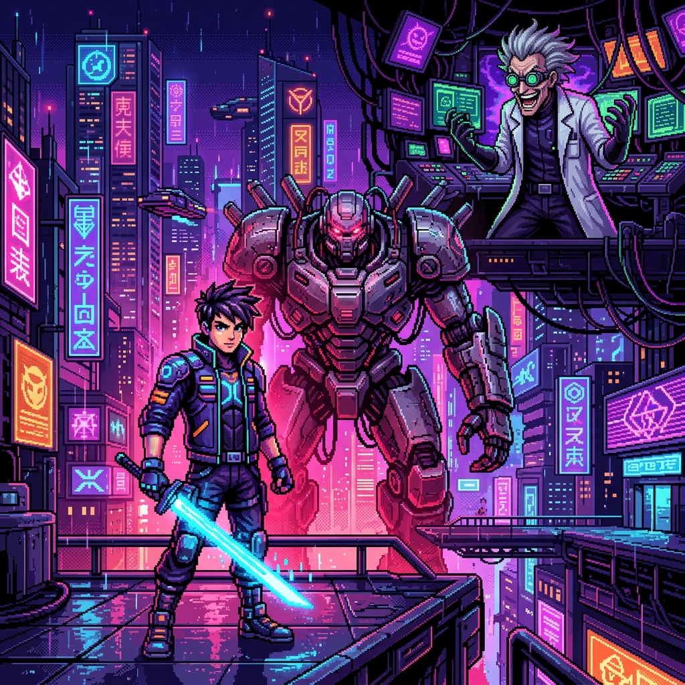

# 🎮 Juego Android: El Elegido ⚡

<p align="center">
  
</p>

<p align="center">
  <a href="https://unity.com/"></a>
  <a href="https://developer.android.com/"></a>
  <a href="https://github.com/dqq0"></a>
  
</p>

---

## 🌟 Sobre el Proyecto

**El Elegido** es una emocionante novela visual interactiva de corte cyberpunk y estética retro pixel-art, construida en **Unity** para dispositivos **Android**. El juego transporta al jugador a una distopía tecnológica de luces de neón, donde cada decisión determinará su destino.

Impulsado por el framework **VNCreator**, este juego implementa un flujo narrativo dinámico donde el jugador toma decisiones que cambian el rumbo de la historia.

---

## 🎭 Personajes Clave

El universo de *El Elegido* gira en torno a tres figuras centrales cuyas voluntades chocarán constantemente:

| Personaje | Rol | Descripción |
| :---: | :---: | :--- |
| **El Protagonista** | Héroe (`prota.png`) | Un joven guerrero equipado con una espada de energía cian, destinado a romper las cadenas de la tiranía corporativa. |
| **El Enemigo** | Antagonista (`enemigo.png`) | Un colosal titán cibernético acorazado con tecnología militar pesada de última generación. |
| **Dr. Vektor** | Científico Loco (`dr_vektor.png`) | La retorcida mente maestra que opera desde las sombras, controlando la red central del sector. |

---

## 🎨 Características Visuales y Sonoras ("Dale Color")

Este proyecto destaca por una dirección de arte meticulosa:
* **Estilo Retro Pixel Art:** Gráficos inspirados en la época dorada de los 16-bits con paletas de colores altamente saturadas (tonos cian, violeta y fucsia).
* **Tipografías Retro:** Inclusión de fuentes clásicas como `Press Start 2P` y `VT323` para lograr una inmersión arcade completa.
* **Sistema de Renderizado Moderno (URP 2D):** Iluminación global en tiempo real y efectos de brillo de neón (Bloom) aplicados sobre sprites planos.
* **Interfaz de Usuario Limpia:** Creada para una experiencia táctil intuitiva y fluida en pantallas móviles.

---

## 🛠️ Estructura del Proyecto Unity

El repositorio está optimizado y estructurado de la siguiente manera:

```text
📁 Assets/
 ├── 📁 Fonts/            # Fuentes tipográficas retro (Press Start 2P, VT323)
 ├── 📁 Imagenes/         # Sprites de personajes y fondos de escena (FONDOE.png)
 ├── 📁 Scenes/           # Escena principal del juego (SampleScene.unity)
 ├── 📁 Settings/         # Configuración del Universal Render Pipeline (URP)
 └── 📁 VNCreator/        # El motor narrativo de Novela Visual (Editor, Nodos y Lógica)
```

---

## 🚀 Cómo Empezar / Importar en Unity

1. **Requisitos:**
   * Unity Editor (Versión recomendada: **2022.3 LTS** o superior).
   * Módulo de soporte para **Android Build Support** instalado en Unity Hub.

2. **Clonar este Repositorio:**
   ```bash
   git clone https://github.com/dqq0/juego-android-el-elegido.git
   ```

3. **Abrir en Unity:**
   * Abre Unity Hub, haz clic en **Add** y selecciona la carpeta descargada.
   * Deja que Unity importe los paquetes y configure el pipeline de renderizado 2D.

4. **Compilar para Android:**
   * Ve a `File` -> `Build Settings`.
   * Cambia la plataforma a **Android** y haz clic en `Switch Platform`.
   * Presiona `Build` para generar tu archivo `.apk`.

---

## 📜 Licencia

Este proyecto está creado con fines educativos y de entretenimiento. El framework **VNCreator** está sujeto a sus propios términos de uso.

*Desarrollado con ❤️ por [dqq0](https://github.com/dqq0).*
